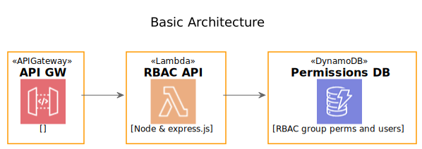

# Role Based Access Control, Serverless, proof of concept <!-- omit in toc -->

Role Based Access Control proof of concept / experiment, based on [Casbin](https://casbin.org/), AWS [Lambda](https://aws.amazon.com/lambda/) and [DynamoDB](https://aws.amazon.com/dynamodb/)

## Table of Contents <!-- omit in toc -->

- [Goals](#goals)
- [Scenario](#scenario)
  - [Groups](#groups)
- [Getting Started](#getting-started)
  - [Software Used](#software-used)
  - [Configuration Steps](#configuration-steps)
  - [Local development](#local-development)
  - [Deployment](#deployment)
    - [Export AWS Credentials (Optional)](#export-aws-credentials-optional)
    - [Deploy](#deploy)
  - [Invocation](#invocation)
    - [Thunder Client (VS Code Extension)](#thunder-client-vs-code-extension)
  - [Endpoints](#endpoints)
    - [Group OR user level enforcement](#group-or-user-level-enforcement)
- [Discussion](#discussion)
  - [Why node and express?](#why-node-and-express)
  - [Why DynamoDB?](#why-dynamodb)
  - [Lambda Cost Control and Performance](#lambda-cost-control-and-performance)
- [References](#references)

## Goals

Many applications end up reinventing wheels by building tightly coupled permissions that rot and become difficult to change. The aims of this poc are:

- Evaluate whether a serverless microservice api can be used to serve multiple client systems (backend API and FE UI).
- Re-use of the [Casbin](https://casbin.org/) engine.
- Later: Adding a react page to manage the permissions.



## Scenario

The set of [users & groups policies](casbin-config/rbac_resource_roles_policy.json) is intended to provide a reasonably sane model with realistic volume of data.

### Groups

Each of the 4 groups "owns" 2 `obj`ects that can be `act`ed on. Each `obj`ect can be `act`ioned following the CRUD model. (`create`, `read`, `update`, `delete`).

100 users were randomly generated and assigned to a group.  
To validate that users can be assigned to multiple groups, the user, `donella.bilbrey@legalandfinance.com` belongs to both the `legal` and `finance` groups.

- sales, 26 users.
  - monthly_sales_report
  - annual_sales_report
- development, 28 users.
  - release_to_staging
  - release_to_production
- finance, 30 users.
  - monthly_accounts
  - annual_accounts
- legal, 16 users.
  - sales_contract
  - employment_contract

## Getting Started

You will need an AWS account with [access keys configured](https://www.serverless.com/framework/docs/providers/aws/guide/credentials/). I have access to short term AWS accounts so can safely [export them on the command line](#export-aws-credentials-optional).

### Software Used

- [Node LTS](https://nodejs.org/en/), See: [`.nvmrc`](.nvmrc)
- [Serverless framework](https://www.serverless.com/), See: [`package.json`](package.json)
- [Docker](https://www.docker.com/)
  - [Docker Compose](https://docs.docker.com/compose/install/) Optional - for local development.

### Configuration Steps

1. Clone this repo

2. Copy `.env.sample` to `.env` and complete

3. Install dependencies

    `npm install`

### Local development

`npm run dev`

This uses `serverless offline` and [docker-compose](docker-compose.yml) to provide:

- The api running on [localhost:3000](localhost:3000)
- A [DynamoDB admin GUI](https://github.com/aaronshaf/dynamodb-admin) at [localhost:8001](http://localhost:8001).
- A [local DynamoDB](https://docs.aws.amazon.com/amazondynamodb/latest/developerguide/DynamoDBLocal.DownloadingAndRunning.html) instance with the table created.

1. **First time** – seed the initial Casbin data into the database by visiting:

    `http://localhost:3000/seed`

### Deployment

#### Export AWS Credentials (Optional)

If not already configured. _Note:_ [The leading space is intentional](https://stackoverflow.com/questions/6475524/do-i-prevent-commands-from-showing-up-in-bash-history)

```bash
 export AWS_ACCESS_KEY_ID=<your-key-here> && export AWS_SECRET_ACCESS_KEY=<your-secret-key-here>
```

#### Deploy

  `serverless deploy`

### Invocation

After successful deployment, the serverless output will contain an endpoint. Take note of this and replace `<your-endpoint-here>` in subsequent commands.

```bash
...
endpoints:
  ANY - https://xxxxxx.execute-api.us-east-1.amazonaws.com
...
```

#### Thunder Client (VS Code Extension)

A suite of example api calls, with simple tests, are provided using the [Thunder client](https://www.thunderclient.io/) VS Code plugin. The definitions are stored in the [thunder-tests](thunder-tests) directory.

_Note:_ Configure the thunder client extension to ["Load From Project"](https://github.com/rangav/thunder-client-support#team-features). After enabling this setting, you may need to restart VS to load the collection.

Api calls can be directed to local or remote endpoints by changing the `Env` => `vars` => `SERVER_ENDPOINT` value.

_Tip:_ A useful sanity check is to use the "Run All" functionality of the permissions collection.

### Endpoints

The implementation is `rbac_with_resource_roles` with the model defined in a [static file](casbin-config/rbac_with_resource_roles_model.conf). The role `g2` is currently unused.

Policies are loaded via the `/seed` endpoint. See [rbac_resource_roles_policy.json](casbin-config/rbac_resource_roles_policy.json) for the definition of the policies used in the code.

| Route                          | HTTP Method | Description                                                                                                                                                                        |
| ------------------------------ | ----------- | ---------------------------------------------------------------------------------------------------------------------------------------------------------------------------------- |
| `/seed`                        | GET         | Development convenience method to load the [sample](casbin-config/rbac_resource_roles_policy.json) policies into dynamoDB. Clears the data and reloads.                            |
| `/enforce/:sub/:obj/:act`      | GET         | Tests a subject, object, action against the seeded policies. _Hint_ `:sub` can be a user OR group.                                                                                 |
| `/rolesfor/:sub`               | GET         | Returns the roles defined for a subject. Wraps Casbin's RBAC `getRolesForUser` _Hint_: try `donella.bilbrey@legalandfinance.com`                                                   |
| `/implicitrolesfor/:sub`       | GET         | Returns the roles defined for a subject. Wraps Casbin's RBAC `getImplicitRolesForUser` _Hint_: try `donella.bilbrey@legalandfinance.com`                                           |
| `/permissionsfor/:sub`         | GET         | Returns the permissions defined for a subject. Wraps Casbin's `getPermissionsForUser` _Hint_: This method requires a group to be passed for results as users perms are via groups. |
| `/implicitpermissionsfor/:sub` | GET         | Returns the permissions defined for a subject. Wraps Casbin's `getImplicitPermissionsForUser` _Note_: Potentially useful to proxy (via an API) to a front end UI                   |

Example call:

```bash
curl <your-endpoint-here>/enforce/angus.muldoon@development.com/release_to_staging/create
```

Which will respond with:

```json
{
  "sub": "angus.muldoon@development.com",
  "obj": "release_to_staging",
  "act": "create",
  "result": true
}
```

#### Group OR user level enforcement

The `/enforce/:sub/:obj/:act` endpoint can be queried with a `:sub` of a user or group. EG:

- `curl <your-endpoint-here>/enforce/angus.muldoon@development.com/release_to_staging/create`
- `curl <your-endpoint-here>/enforce/development/release_to_staging/create`

## Discussion

### Why node and express?

Casbin is implemented in a number of languages. Go appears to be the best supported and "native" language. node.js was selected as it is widely supported with plugins, easily understood and [cold startup times](https://mikhail.io/serverless/coldstarts/aws/) in lambda are fast.

The aim is to be a Casbin "wrapper", therefore little custom code is needed.

### Why DynamoDB?

DynamoDB is serverless and fully managed. The maintenance overhead is low.

Typically permissions are a read heavy workload. If performance becomes an issue then [DAX](https://aws.amazon.com/dynamodb/dax/) should be evaluated.

Alternatively Casbin has support for a wide range of [backend storage adaptors](https://casbin.org/docs/en/adapters) so the implementation can easily be changed depending on throughput requirements.

### Lambda Cost Control and Performance

The lambda is currently configured to use the `x86_64` architecture.

There is potential for significant cost savings, while increasing performance, by changing the architecture to `arm64`. More information can be found at the [AWS blog](https://aws.amazon.com/blogs/aws/aws-lambda-functions-powered-by-aws-graviton2-processor-run-your-functions-on-arm-and-get-up-to-34-better-price-performance/)

## References

- [Serverless Framework Node Express API on AWS template](https://github.com/serverless/examples/tree/master/aws-node-express-dynamodb-api)
- [casbin-dynamodb-adapter](https://github.com/fospitia/casbin-dynamodb-adapter)
- [node-casbin](https://github.com/casbin/node-casbin)
- [casbin example models & policies](https://github.com/casbin/casbin/tree/master/examples)
- [casbin RBAC api](https://casbin.org/docs/en/rbac-api)
